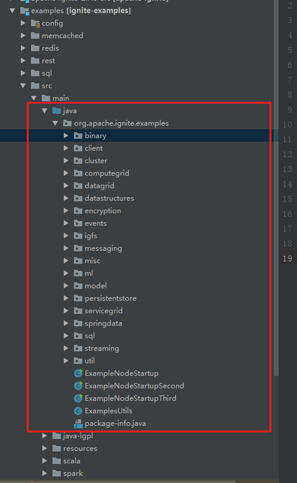

# 目录结构

``` lua
apache-ignite-example
├── apache-ignite-2.7.6-src     -- ignite的源码包
├── examples                    -- Ignite-Test用例
```
examples中的代码用例,直接引用的便是ignite包中的源代码，无需再重复下载ignite jar 便与调试；

## Project import
* IDEA导入项目后,分别在examples以及apache-ignite-2.7.6-src目录下的pom.xml上右键Add as maven project；

* apache-ignite-2.7.6-src/modules下所有的Ignite源码子模块全部都被加载为Maven项目后，则导入完成；


# [示例](examples)

项目全部导入完成后，便可直接打开examples/src/main/java/org/apache/ignite/examples目录，
以下便为当前所有的Test实例;



