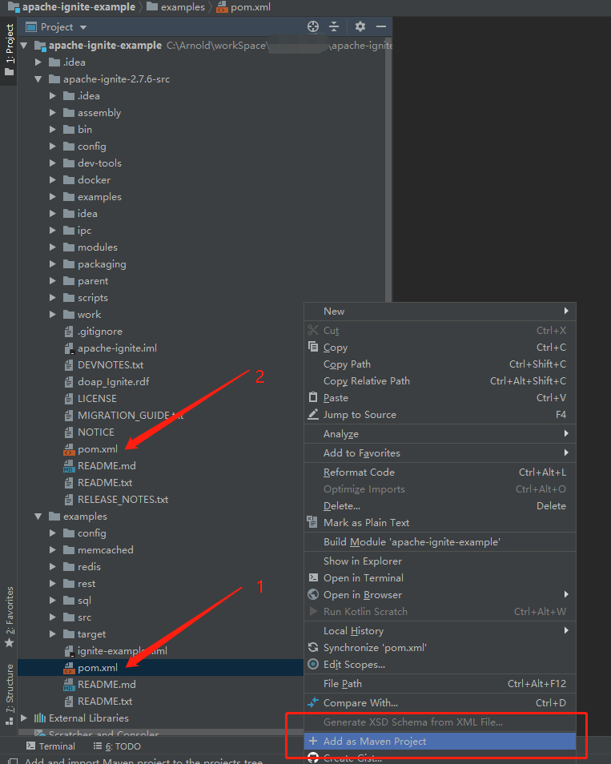
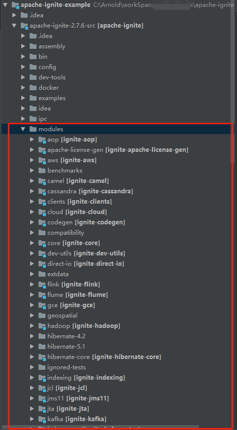

# 目录结构

``` lua
apache-ignite-example
├── apache-ignite-2.7.6-src     -- ignite的源码包
├── examples                    -- Ignite-Test用例
```
examples中的代码用例,直接引用的便是ignite包中的源代码，无需再重复下载ignite jar 便与调试；

## IDEA导入步骤
* 分别在examples以及apache-ignite-2.7.6-src目录下的pom.xml上右键Add as maven project；



* apache-ignite-2.7.6-src/modules下所有的Ignite源码子模块全部都被导入为Maven项目后，则此时导入完成；



# [Demo示例](examples/README.md)

项目全部导入完成后，便可直接打开examples/src/main/java/org/apache/ignite/examples目录，
以下便为当前所有的Test实例;


